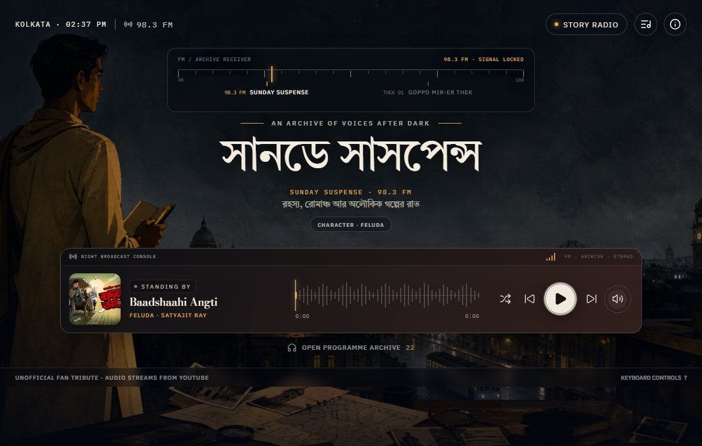

# গল্পের আসর — Golper Asor

A cinematic Bengali audio-story radio for exploring **Sunday Suspense** and
**Goppo Mir-er Thek** through characters, writers, genres, and original series.



> **Unofficial fan project.** Golper Asor is not affiliated with Mirchi Bangla,
> Radio Mirchi, Goppo Mir-er Thek, RJ Mir, or the writers and publishers whose
> work appears in the linked broadcasts. Audio is streamed from the official
> YouTube channels and is never hosted by this repository.

## Experience

- Two radio-style stations with a silent tuning transition
- Bengali-first station identity with English callsigns
- Full-screen Programme Guide with channel switching, collection filters, and search
- Browse by character, writer, genre, or original series without interrupting playback
- Curated playlists from the official Mirchi Bangla and Real Mir channels
- Character-specific cinematic backgrounds
- Context-aware story titles that remove broadcaster, cast, and episode-label clutter
- Interactive signal-waveform seeking and custom transport controls
- Personal listening queues with add, remove, reorder, previous, and next controls
- Play, shuffle, or queue an entire character, writer, genre, or original-series collection
- Queue persistence between visits without autoplaying on return
- Anonymous per-channel **online now** visitor counts powered by realtime presence
- One-tap handoff from the player to the current story on YouTube
- Responsive programme archive for desktop and mobile
- Keyboard controls and reduced-motion support
- No autoplay: every broadcast waits for an explicit listener action

## Catalogue

The launch catalogue is defined in [`src/catalogue.ts`](src/catalogue.ts). It
currently includes 75 curated collections, including:

- **Characters:** Feluda, Byomkesh Bakshi, Professor Shonku, Taranath Tantrik,
  Kakababu, Kiriti Roy, Tenida, Eken Babu, and Sherlock Holmes
- **Writers and works:** Rabindranath Tagore, Bankim Chandra Chattopadhyay,
  Saradindu Bandyopadhyay, Sarat Chandra Chattopadhyay, Suchitra Bhattacharya,
  Satyajit Ray, Agatha Christie, Charles Dickens, Victor Hugo, and more
- **Genres:** detective, horror, adventure, historical, comedy, and romance
- **Originals:** GMT Shorts, GMT Onstage, GMT Originals, Shorojontro,
  Mukhosher Arale, and Golpo Mancho

Unverified and non-story playlists are intentionally excluded.

## Programme guide and queue

Open **Programme Guide** to explore both stations in a dedicated catalogue view.
Collections can be searched or filtered by character, writer, genre, and
original series. Choosing a collection reveals its broadcasts without stopping
the story currently playing.

The writer catalogue is hierarchical: each writer has a dedicated archive with
their named series and shared character collections. A playlist is stored once,
so collections such as Feluda, Byomkesh, Kakababu, Professor Shonku, and
Rajkahini can appear under both their primary category and their writer without
duplicating broadcasts.

Each collection supports three listening modes:

- **Play all** replaces the current queue and starts from the first broadcast.
- **Shuffle all** replaces the queue with that collection in a random order.
- **Add all** appends broadcasts that are not already in the personal queue.

Writer archives provide the same play, shuffle, and add controls across every
series by that writer, while retaining separate controls for an individual
series.

Individual broadcasts can also be added from the guide. The **Current queue**
drawer supports reordering and removing upcoming stories. Queue state is saved
locally in the listener's browser; restoring a saved queue never starts audio
until the listener presses play.

## Tech stack

- React 19
- TypeScript
- Vite
- YouTube IFrame Player API
- Supabase Realtime Presence
- Lucide icons
- Google Fonts: Tiro Bangla, Bodoni Moda, and IBM Plex

Supabase is used only for anonymous realtime listener presence. No listener
profiles or personal details are stored by the application.

## Local development

Requirements: Node.js 20 or newer and npm.

```bash
git clone https://github.com/kaustavr19/Golper-Asor.git
cd Golper-Asor
npm install
copy .env.example .env.local
npm run dev
```

Set `VITE_SUPABASE_URL` and `VITE_SUPABASE_PUBLISHABLE_KEY` in `.env.local`
before starting the development server.

The development server will print the local URL, normally
`http://localhost:5173`.

## Commands

```bash
npm run dev      # Start the Vite development server
npm run build    # Type-check and create the production build
npm run lint     # Run oxlint
npm run preview  # Preview the production build locally
```

## Deploying to Vercel

The repository includes [`vercel.json`](vercel.json), although Vercel also
detects the Vite configuration automatically.

1. Import `kaustavr19/Golper-Asor` in Vercel.
2. Keep the detected framework as **Vite**.
3. Build command: `npm run build`.
4. Output directory: `dist`.
5. Add `VITE_SUPABASE_URL` and `VITE_SUPABASE_PUBLISHABLE_KEY` to the Vercel
   project environment variables.
6. Deploy.

[Deploy with Vercel](https://vercel.com/new/clone?repository-url=https://github.com/kaustavr19/Golper-Asor)

## Keyboard controls

| Key | Action |
| --- | --- |
| `Space` | Play or pause |
| `←` / `→` | Seek 5 seconds |
| `Shift` + `←` / `→` | Previous or next broadcast |
| `↑` / `↓` | Adjust volume |
| `M` | Mute |
| `S` | Surprise broadcast / shuffle |
| `?` | Open shortcut guide |

## Project structure

```text
src/
├── assets/              Character and atmospheric backgrounds
├── components/          Player, waveform, programme guide, queue, and radio controls
├── hooks/               YouTube playback, queue, and realtime presence integration
├── lib/                 Shared service clients
├── utils/               Title parsing and thumbnail helpers
├── catalogue.ts         Channel and playlist catalogue
├── App.tsx              Main experience and interaction state
└── App.css              Responsive visual system
```

## Content and artwork

Playlist IDs point to publicly available YouTube playlists. Titles and playlist
order are obtained at runtime through the YouTube player and noembed metadata.

The background illustrations are original, AI-assisted fan-art interpretations
created for this interface. They intentionally avoid actor likenesses, official
logos, and copied film or television designs.

## Notes

- A network connection is required for YouTube playback, thumbnails, metadata,
  and hosted fonts.
- Playlist contents and counts can change when the source channels update them.
- Browser media policies are respected; the site does not autoplay audio.
